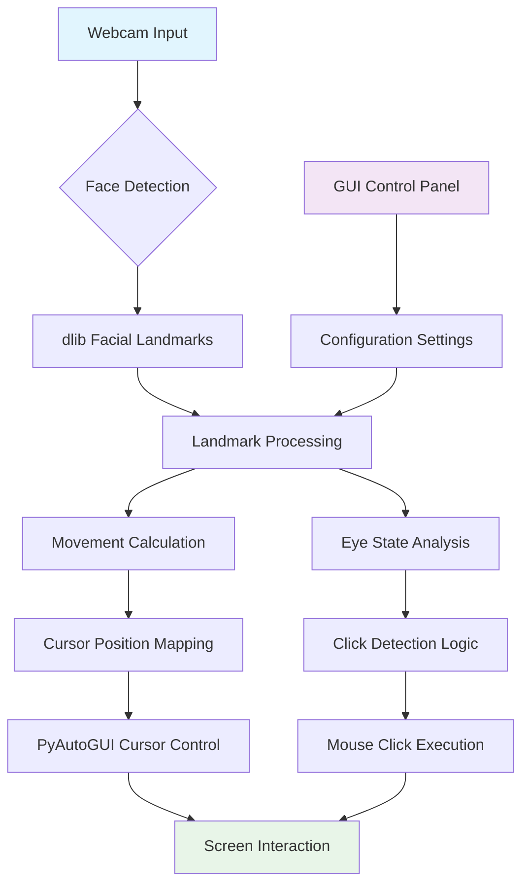
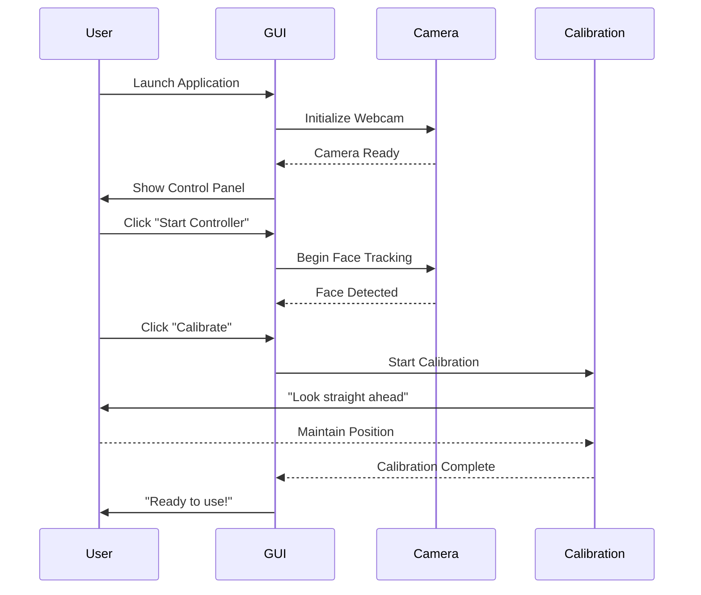

# Facial Mouse Controller 🎯

<div align="center">


**Control your computer cursor using only facial movements**  
A hands-free cursor control system for accessibility and convenience

[Quick Start](#-quick-start) • [Features](#-features) • [Installation](#️-installation) • [Documentation](docs/)

</div>

---

## ✨ Features

| Feature | Icon | Description | Status |
|---------|------|-------------|--------|
| **Face Tracking** | 👁️ | Real-time facial landmark detection | ✅ |
| **Cursor Control** | 🖱️ | Smooth cursor movement with head motion | ✅ |
| **Click Detection** | 👁️👁️ | Eye blink detection for mouse clicks | ✅ |
| **Drag & Drop** | 🎯 | Drag operations via wink patterns | ✅ |
| **Calibration** | 🎛️ | Personalized movement range setup | ✅ |
| **GUI Control** | 🖥️ | User-friendly control panel | ✅ |
| **Visual Feedback** | 📊 | Real-time face tracking visualization | ✅ |
| **Settings Persistence** | 💾 | Save/load personalized configurations | ✅ |

## 🚀 Quick Start

### 1-Minute Setup

```bash
# Clone the repository
git clone https://github.com/kiprutobeauttah/facial-mouse-controller.git
cd facial-mouse-controller

# Install dependencies
pip install -r requirements.txt

# Download face model
python download_model.py

# Run the application
python facial_mouse.py --gui
```

### Prerequisites
- 🐍 Python 3.8 or higher
- 📷 Webcam
- 💻 4GB RAM minimum

## 📊 System Architecture



## ⚙️ Installation

### Step-by-Step Setup

#### 1. Install Python Dependencies

```bash
# Core dependencies
pip install opencv-python numpy pyautogui dlib

# Optional: For better performance
pip install imutils scipy
```

#### 2. Download Face Landmark Model

```bash
# Windows PowerShell
Invoke-WebRequest -Uri "http://dlib.net/files/shape_predictor_68_face_landmarks.dat.bz2" -OutFile "shape_predictor_68_face_landmarks.dat.bz2"

# Extract the file
7z x shape_predictor_68_face_landmarks.dat.bz2
```

> **Note:** Place the extracted `.dat` file in the project root directory.

#### 3. Verify Installation

```bash
python -c "import cv2, dlib, pyautogui; print('✅ All dependencies installed successfully!')"
```

### Platform-Specific Notes

| Platform | Installation Notes | Status |
|----------|-------------------|--------|
| **Windows** | Direct pip install works | ✅ Full Support |
| **macOS** | Requires CMake: `brew install cmake` | ✅ Full Support |
| **Linux** | Install system packages first | ✅ Full Support |
| **Raspberry Pi** | ARM optimizations available | ⚠️ Experimental |

## 🎯 Usage Guide

### Starting the Application

#### Option 1: GUI Mode (Recommended)
```bash
python facial_mouse.py --gui
```

#### Option 2: Command Line Only
```bash
python facial_mouse.py
```

### First-Time Setup Workflow



### Control Methods

| Action | Gesture | Visual Feedback |
|--------|---------|-----------------|
| **Cursor Move** | Head movement | Green face landmarks |
| **Left Click** | Blink left eye | 🟥 Left indicator turns red |
| **Right Click** | Blink right eye | 🟥 Right indicator turns red |
| **Double Click** | Blink both eyes | 🟥 Both indicators turn red |
| **Drag Start** | Wink left eye | "DRAGGING" text appears |
| **Drag End** | Wink right eye | "DRAGGING" text disappears |
| **Calibrate** | Press 'c' key | Blue calibration box appears |

### Keyboard Shortcuts

| Key | Function | Status Indicator |
|-----|----------|------------------|
| `C` | Calibrate | 🔵 Blue calibration box |
| `P` | Pause/Resume | ⏸️/▶️ Status text changes |
| `Q` | Quit | Application closes |
| `S` | Save settings | 💾 Settings saved message |

## 🔧 Configuration

### Settings Overview

```yaml
# facial_mouse_settings.json (example)
cursor:
  speed: 1.5          # Movement multiplier (0.5-3.0)
  smoothing: 0.5      # Motion smoothing (0.1-0.9)
  relative_mode: true # Relative vs absolute movement

click_detection:
  threshold: 0.25     # Eye closure sensitivity (0.1-0.5)
  duration: 15        # Frames needed for click
  left_click: true    # Enable left click
  right_click: true   # Enable right click
  drag_enabled: true  # Enable drag operations

visual:
  show_feedback: true # Show face landmarks
  show_indicators: true # Show eye state indicators
```

### Performance Tuning Guide

| Setting | Low Performance | Balanced | High Precision |
|---------|-----------------|----------|----------------|
| **Cursor Speed** | 2.0 | 1.5 | 1.0 |
| **Smoothing** | 0.7 | 0.5 | 0.3 |
| **Click Threshold** | 0.3 | 0.25 | 0.2 |
| **Camera FPS** | 15 | 30 | 60 |

## 📁 Project Structure

```
facial-mouse-controller/
├── 📁 docs/                    # Documentation
│   ├── images/                # Screenshots and diagrams
│   └── technical/             # Technical documentation
├── 📁 src/                    # Source code
│   ├── facial_mouse.py       # Main application
│   ├── controller.py         # Core controller class
│   ├── gui.py               # GUI control panel
│   ├── calibration.py       # Calibration module
│   └── utils.py            # Utility functions
├── 📁 models/                # Machine learning models
│   └── shape_predictor_68_face_landmarks.dat
├── 📁 config/                # Configuration files
│   ├── default.json         # Default settings
│   └── user_profiles/       # User-specific profiles
├── 📄 requirements.txt       # Python dependencies
├── 📄 LICENSE               # MIT License
└── 📄 README.md            # This file
```

## 🔍 Troubleshooting

### Common Issues and Solutions

| Issue | Symptoms | Solution |
|-------|----------|----------|
| **No Face Detected** | Camera shows but no landmarks | Ensure good lighting; Adjust camera angle |
| **Jumpy Cursor** | Cursor moves erratically | Increase smoothing factor; Recalibrate |
| **Clicks Not Registering** | Blinks don't trigger clicks | Decrease click threshold; Check eye visibility |
| **High CPU Usage** | System slows down | Reduce camera resolution; Close other applications |
| **Model File Missing** | "Predictor not found" error | Download and extract the model file |

### Diagnostic Commands

```bash
# Test camera
python -c "import cv2; cap = cv2.VideoCapture(0); print(f'Camera test: {cap.isOpened()}')"

# Test face detection
python test_face_detection.py

# Generate system report
python generate_report.py
```

## 🤝 Contributing

We welcome contributions! Here's how to help:

### Contribution Workflow


### Areas Needing Contribution

| Priority | Area | Skills Needed |
|----------|------|---------------|
| 🔴 High | Performance optimization | C++, CUDA |
| 🟡 Medium | Additional gestures | Computer Vision |
| 🟢 Low | Documentation | Technical Writing |
| 🔵 Low | UI improvements | PyQt, Tkinter |

### Code Standards
- Follow PEP 8 guidelines
- Add type hints for new functions
- Write docstrings for public methods
- Include tests for new features

## 📄 License

This project is licensed under the MIT License - see the [LICENSE](LICENSE) file for details.

## 🙏 Acknowledgments

### Libraries Used
- **[OpenCV](https://opencv.org/)** - Computer vision library
- **[dlib](http://dlib.net/)** - Machine learning toolkit
- **[PyAutoGUI](https://pyautogui.readthedocs.io/)** - GUI automation
- **[NumPy](https://numpy.org/)** - Numerical computing

### Special Thanks
- **Davis King** for dlib and facial landmark model
- **OpenCV community** for continuous improvements
- **All contributors** who have helped improve this project
-**Beauttah K.** pioneered the project
---

<div align="center">

**Made with ❤️ for accessibility and innovation**

[Report Bug](https://github.com/kiprutobeauttah/facion/issues) · 
[Request Feature](https://github.com/kiprutobeauttah/facion/issues) · 
[View Changelog](CHANGELOG.md)

⭐ **Star this project if you find it useful!**

</div>

---

*Note: This is a prototype project. Use at your own risk. Always ensure physical safety when using hands-free systems.*
